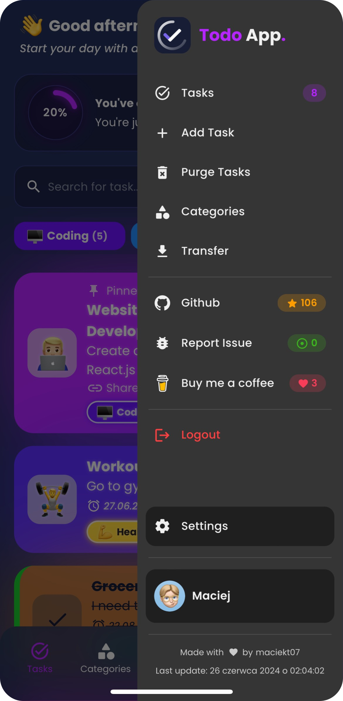

<!-- <p align="center">

</p> -->

# 📝 React Todo App

A **simple, clean, and modern Todo App built using React**, created to practice frontend development and manage daily tasks easily.

---

## 🚀 Live Demo

[🔗 View Live](https://your-todo-app.netlify.app/) <!-- Replace with your deployed URL -->

---

## 💻 Tech Stack

- ⚛️ React
- 🟦 TypeScript
- ⚡ Vite
- 🎨 Material UI (MUI)

---

## ⚡ Features

✅ Add, edit, and delete tasks  
✅ Mark tasks as completed  
✅ Light and dark mode support  
✅ Responsive design for all devices  
✅ Installable as a PWA for offline usage

---

## 📸 Screenshots

<!-- Add your screenshots in the `screenshots/` folder and remove the comments below when added -->

<!--


-->

---

## 🛠️ Installation

Follow these steps to run the project locally:

```bash
# Clone the repository
git clone https://github.com/rasamallaakhil/react-todo-app.git

# Navigate to the project directory
cd react-todo-app

# Install dependencies
npm install

# Run the development server
npm run dev
